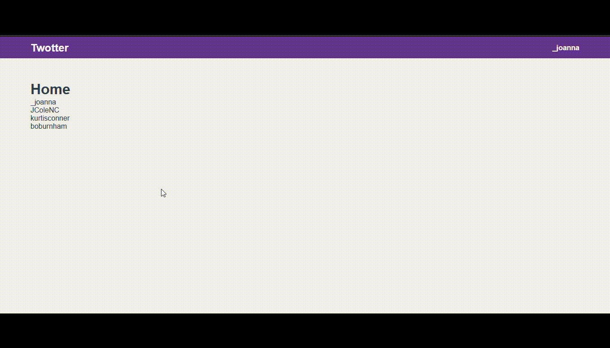

# twotter-vue3
Create a simple app, using **Vue3**, **vue ui**, **vue-router** & **vue-vuex**.

## Project setup
```
npm install
```

### Compiles and hot-reloads for development
```
npm run serve
```

### Compiles and minifies for production
```
npm run build
```

### Lints and fixes files
```
npm run lint
```

### UI


### Live at 
[twottter-vue3.Herokuapp](https://twottter-vue3.herokuapp.com/)
